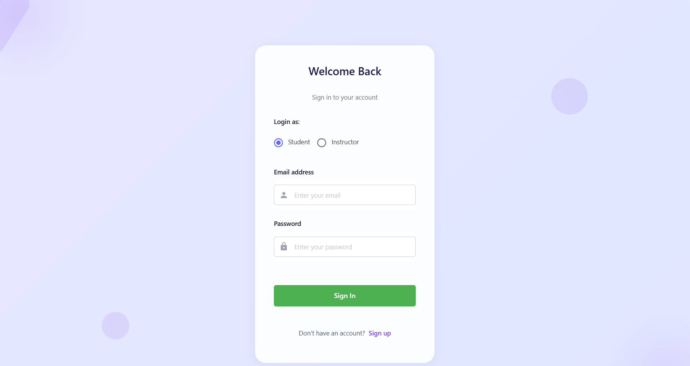
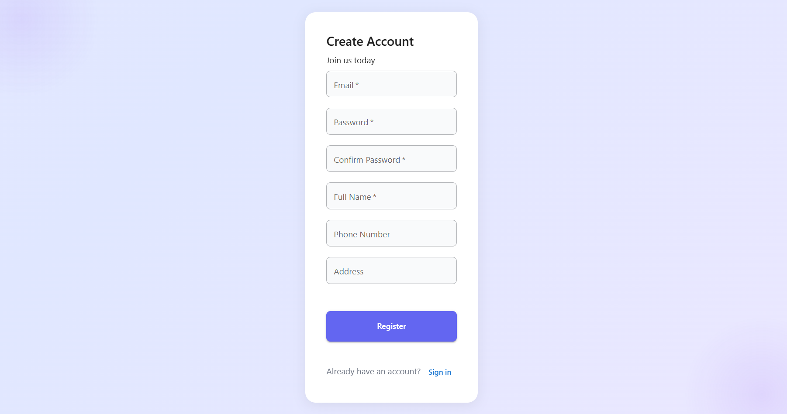
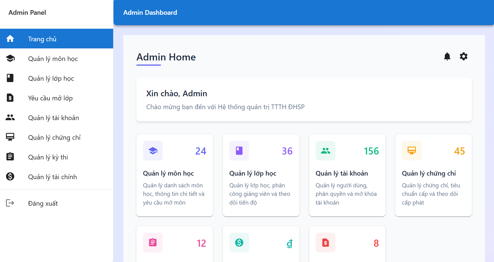
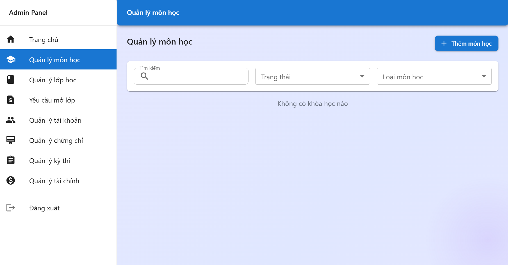
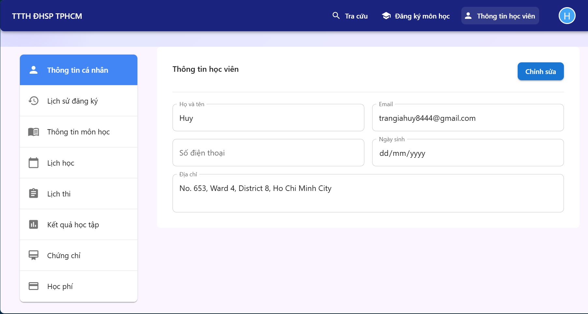

# 🎓 Course Management Frontend

[](https://reactjs.org/)
[](https://www.typescriptlang.org/)
[](https://mui.com/)
[](https://vitejs.dev/)
[](https://axios-http.com/)

A modern and responsive frontend application for the Course Management System, built with React and TypeScript. This application provides an intuitive user interface for managing courses, classes, enrollments, and payments.

## 📸 Screenshots

Here are some key screenshots of the application. Note that these are just a few examples of the many features and interfaces available in the system.

### Login & Registration

*Secure login interface with role-based access*


*User registration form with validation*

### Admin Interface

*Admin dashboard with comprehensive management tools*

### Course Management

*Course listing and management interface*

### Student Profile

*Student profile and enrollment management*

## 🚀 Features

### User Interface
- Responsive design for all devices
- Modern Material-UI components
- Intuitive navigation
- Real-time feedback
- Loading states and error handling

### Authentication
- Role-based access control
- Secure token management
- Session handling
- Protected routes

### Course Management
- Course listing and search
- Course details view
- Class scheduling
- Course enrollment
- Progress tracking

### Payment Integration
- VNPay payment gateway
- Payment status tracking
- Transaction history
- Secure payment flow

## 🛠️ Technical Stack

### Frontend
- React 18
- TypeScript
- Material-UI
- Vite
- Axios for API calls

### State Management
- React Context
- Local Storage
- Custom Hooks

### Development Tools
- ESLint
- TypeScript
- Vite Dev Server
- React DevTools

## 🎯 Project Goals

This frontend project was developed with the following objectives:
- Create a user-friendly course management interface
- Implement responsive and accessible design
- Ensure smooth user experience
- Provide real-time feedback
- Follow modern React best practices
- Maintain code quality and type safety

## 💻 Installation

1. Clone the repository
```bash
git clone https://github.com/yourusername/course_management_frontend.git
```

2. Install dependencies
```bash
npm install
```

3. Set up environment variables
```bash
cp .env.example .env
# Edit .env with your configuration
```

4. Start the development server
```bash
npm run dev
```

5. Build for production
```bash
npm run build
```

## 📚 Key Components

### Authentication
- `AdminLogin` - Admin authentication
- `StudentLogin` - Student authentication
- `InstructorLogin` - Instructor authentication

### Course Management
- `CourseList` - Display and search courses
- `CourseDetails` - Course information and enrollment
- `ClassManagement` - Class scheduling and management

### User Management
- `UserProfile` - User information and settings
- `EnrollmentHistory` - Track course enrollments
- `PaymentHistory` - View payment transactions

## 📚 Learning Outcomes

Through this project, I have gained:
- Experience with React and TypeScript
- Understanding of Material-UI components
- State management techniques
- API integration with Axios
- Environment configuration
- Responsive design implementation
- Error handling and user feedback
- Performance optimization
- Code organization and structure

## 🔍 Future Improvements

- Implement real-time updates
- Add more interactive features
- Enhance form validation
- Improve error handling
- Add comprehensive testing
- Implement caching strategies
- Add analytics tracking
- Improve accessibility

## 🤝 Contributing

Contributions are welcome! Please feel free to submit a Pull Request.

## 📄 License

This project is licensed under the MIT License - see the LICENSE file for details.

## 📞 Contact

For any inquiries or feedback, please reach out to:
- Email: [leductin.ld@gmail.com](mailto:leductin.ld@gmail.com)
- GitHub: [leductinjl](https://github.com/leductinjl)